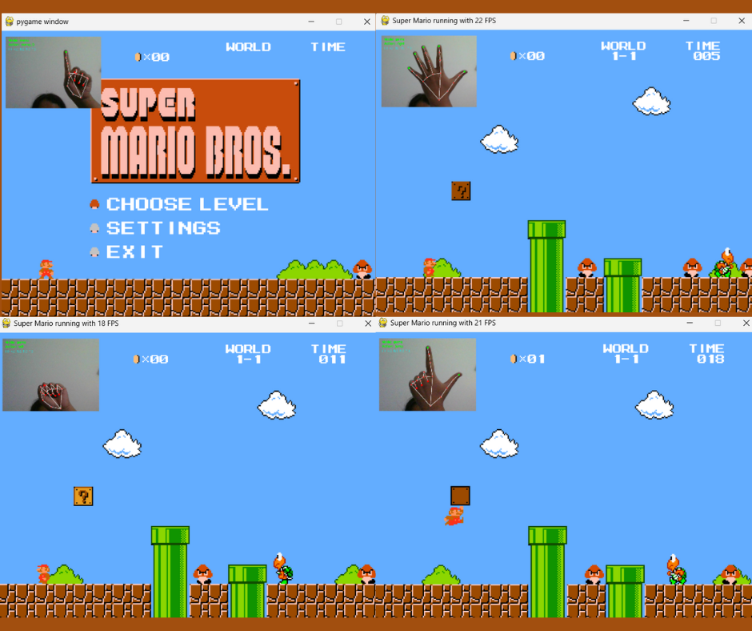

# Super Mario Implementation in Python with Hand Gesture Control

This is inspired by Meth-Meth-Method's [super mario game](https://github.com/meth-meth-method/super-mario/) but enhanced with **computer vision-based hand gesture controls** using MediaPipe and OpenCV.

## Features

- **Hand Gesture Control**: Control Mario using hand gestures captured by your webcam
- **Classic Keyboard Controls**: Traditional keyboard input still supported
- **Real-time Webcam Preview**: See your hand gestures in the corner of the game screen
- **Multiple Levels**: Level 1-1 and Level 1-2 available
- **Menu Navigation**: Navigate menus using hand gestures
- **Classic Mario Gameplay**: Enemies (Goombas, Koopas), power-ups, coins, and more

## Installation & Running

### Prerequisites
Make sure you have a webcam connected to your computer for hand gesture control.

### Installation
```bash
pip install -r requirements.txt
```

### Running the Game
```bash
python main.py
```

## Hand Gesture Controls

### Menu Navigation
- **👍 Thumb Only**: Select first menu option
- **☝️ Index Finger Only**: Select first menu option  
- **✌️ Index + Middle Fingers**: Select second menu option
- **🤟 Index + Middle + Ring Fingers**: Select third menu option
- **👍☝️ Thumb + Index Finger**: Confirm selection

### In-Game Controls
- **✊ Closed Fist (No Fingers)**: Move Mario left
- **🖐️ All Fingers Extended**: Move Mario right
- **☝️ Index Finger Only**: Jump
- **✌️ Index + Middle Fingers**: Boost/Run faster

## Technical Details

- **Computer Vision**: Uses MediaPipe for hand landmark detection
- **Game Engine**: Built with Pygame
- **Image Processing**: OpenCV for webcam capture and processing
- **Architecture**: Object-oriented design with traits system for character behaviors

## Current State


## Dependencies
- **pygame** (≥2.1.0): Game development framework
- **opencv-python** (≥4.11.0): Computer vision and webcam capture
- **mediapipe** (≥0.10.21): Hand landmark detection and gesture recognition
- **scipy** (≥1.10.0): Scientific computing utilities	
